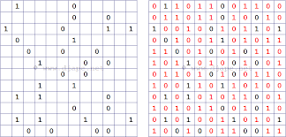

## Jeux-du-Takuzu-application-Shiny

Le jeu de Takuzu également connu sous le nom de Binairo ou Binaire,est un jeu de logique avec des règles simples et des solutions complexes se jouant sur un plateau carré de  n x n cases.Chaque case ne peut contenir un 0 ou 1,les régles sont les suivantes:
1. Chaque ligne et chaque colonne doivent contenir autant de 0 que de 1.
2. Il est interdit d’avoir trois 0 ou trois 1 consécutifs dans une ligne ou une colonne.
3. Deux lignes ou deux colonnes identiques sont interdites dans la même grille.

Exemple, passant d'une grille partiellement pré-remplie à une grille remplie :
<div align="center">
  
</div>


## Installation et exécution

### 1. Cloner le dépôt
Pour récupérer le projet sur votre machine locale, utilisez la commande suivante dans un terminal :

```sh
git clone https://github.com/LamiaOulebsir/JeuTAKUZU.git
cd JeuTAKUZU
